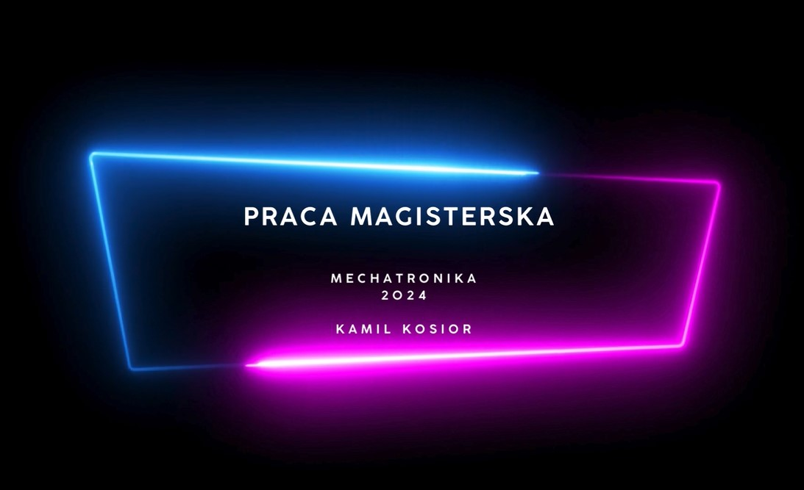

Praca-magisterska---sterowanie-lini-technologiczna-
 <h2 align="center">  
Praca magisterska - sterowanie linią technologiczną do realizacji wybranych procesów produkcyjnych ram podwozi samochodów elektrycznych. 
</h2>

IN WORK! 

If you want watch how it works, clik on the screen.

## General Info
The project involves controlling a production line for electric vehicle frames with an emphasis on virtual commissioning. The work includes CAD modeling of the equipment, system control using PLC and industrial robots with consideration of safety, presentation of pneumatic operation, and behavior of the controller depending on the settings. Sensor, actuator, and control systems were selected. Design environments for production lines were compared. Simulation tests of the technological line operation were conducted.

## Technologies
- Tia Portal 
- RobotStudio
- Inventor
- FactoryIO
- FluidSim
- Proneta

## About the Tia Portal 
- [Hardware](#Hardware)
- [Project Tree](#Project-tree)
- [PLC Programm](#PLC-programm)
- [Safety](#Safety)
- [Main Screen](#Main-screen)
- [Fixtures](#Fixtures) 
- [Robots](#Robots) 
- [Turntable](#Turntable) 
- [Magazines](#Magazines)
- [Ground Conveyor](#Ground-conveyor)
- [Washing Machine](#Wash)
- [PID](#PID)
- [Layout](#Layout)
- other systems screens

## About the RobotStudio
- [Model](#Model)
- [Program](#Program)
- [Station Logic](#Station-logic)

## About the Inventor
- [Frame Model](#Frame-Model)
- [Turntable Model](#Turntable-Model)
- [Magazine Model](#Magazine-Model)

## About the FactoryIO
- [PID Model](#PID-Model)

## About the FluidSim
- [FluidSim Model](#FluidSim-Model)

## About the Proneta
- [Hardware Proneta](#Hardware-proneta)

## Hardware

  

This is project tree. We can see all blocks, tags.

