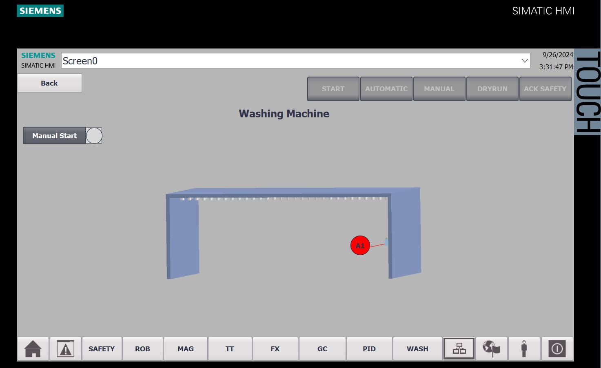
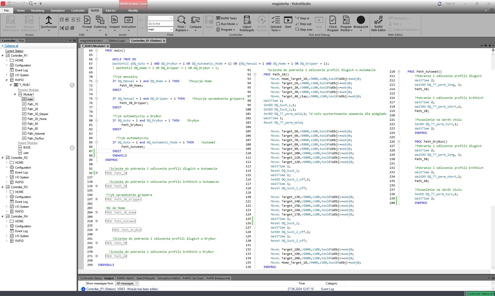
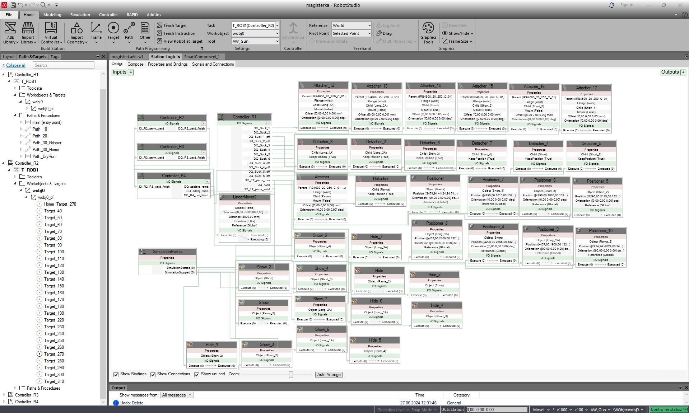

Praca-magisterska---sterowanie-lini-technologiczna-
 <h2 align="center">  
Praca magisterska - sterowanie linią technologiczną do realizacji wybranych procesów produkcyjnych ram podwozi samochodów elektrycznych. 
</h2>

IN WORK! 

If you want watch how it works, clik on the screen.

## General Info
The project involves controlling a production line for electric vehicle frames with an emphasis on virtual commissioning. The work includes CAD modeling of the equipment, system control using PLC and industrial robots with consideration of safety, presentation of pneumatic operation, and behavior of the controller depending on the settings. Sensor, actuator, and control systems were selected. Design environments for production lines were compared. Simulation tests of the technological line operation were conducted.

## Technologies
- Tia Portal 
- RobotStudio
- Inventor
- FactoryIO
- FluidSim
- Proneta

## About the Tia Portal 
- [Hardware](#Hardware)
- [Project Tree](#Project-tree)
- [PLC Programm](#PLC-programm)
- [Safety](#Safety)
- [Main Screen](#Main-screen)
- [Fixtures](#Fixtures) 
- [Robots](#Robots) 
- [Turntable](#Turntable) 
- [Magazines](#Magazines)
- [Ground Conveyor](#Ground-conveyor)
- [Washing Machine](#Wash)
- [PID](#PID)
- [Layout](#Layout)
- other systems screens

## About the RobotStudio
- [Model](#Model)
- [Program](#Program)
- [Station Logic](#Station-logic)

## About the Inventor
- [Frame Model](#Frame-Model)
- [Turntable Model](#Turntable-Model)
- [Magazine Model](#Magazine-Model)

## About the FactoryIO
- [PID Model](#PID-Model)

## About the FluidSim
- [FluidSim Model](#FluidSim-Model)

## About the Proneta
- [Hardware Proneta](#Hardware-proneta)

## Hardware

  

TEXT

## Project Tree

  

TEXT

## PLC Program

  

TEXT

  

TEXT

  

TEXT

## Safety

  

TEXT

## Main screen

  

TEXT

## Fixtures

  

TEXT

## Robots

  

TEXT

## Turntable

  

TEXT

## Magazines

  

TEXT

## Ground Conveyor

  

TEXT

## Washing Machine

  

TEXT

## PID

  

TEXT

## Layout

  

TEXT

## Model

  

TEXT

## Program

  

TEXT

## Station Logic

  

TEXT

## Frame Model

  

TEXT

## Turn Table Model

  

TEXT

## Magazine Model

  

TEXT

## PID Model

  

TEXT

## FluidSim Model

  

TEXT

## Hardware Proneta

  

TEXT

